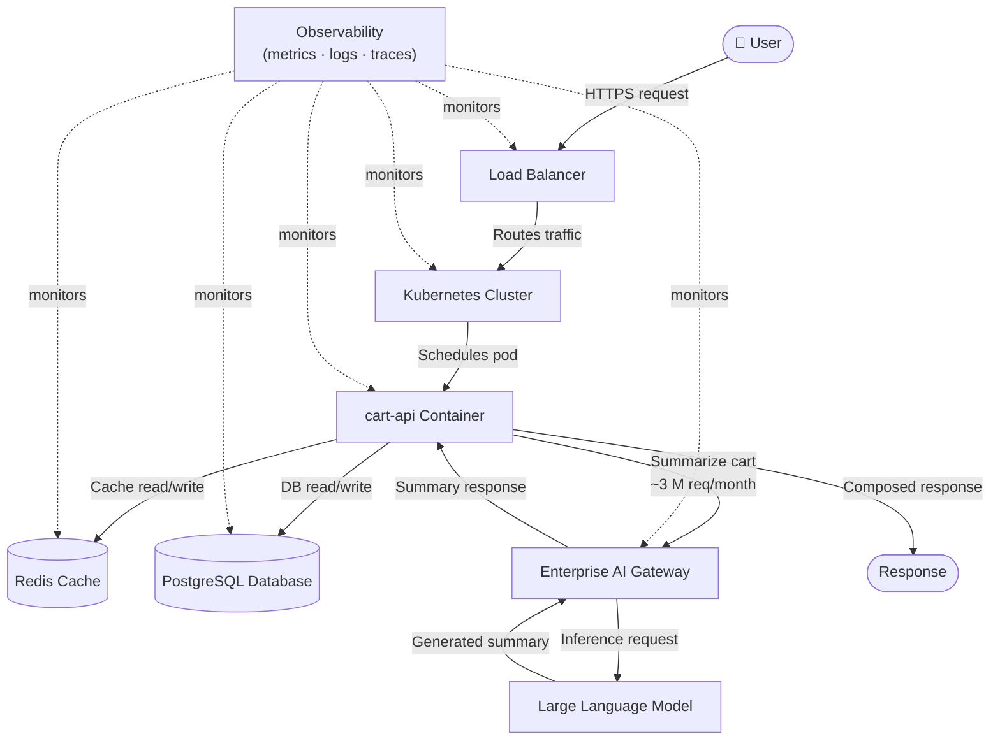

# Stack Ownership Map

This document maps every component in the `cart-api` request path to a named owner category.
Its purpose is to make infrastructure and product responsibilities explicit, surface operational
dependencies, and provide a shared reference for on-call teams, platform engineers, and
service owners.

---

## Service Overview

**Service:** `cart-api`

`cart-api` is a checkout service that runs as containers on a Kubernetes cluster, exposed to
clients through a load balancer. It persists cart state to a PostgreSQL database and uses
Redis as a read-through cache to reduce database load. For the **Summarize my cart** feature,
the service calls a Large Language Model (LLM) via the Enterprise AI Gateway, generating
approximately **3,000,000 AI requests per month**.

---

## Request Flow

The diagram below traces the two primary request paths through the system:

- **Standard path** — a read or write operation against cart data.
- **AI-augmented path** — a "Summarize my cart" request that additionally invokes the LLM.

Observability tooling monitors infrastructure components out-of-band and is shown separately
from the main request path.

---

## Component Ownership

| Component | Responsibility | Owner | Notes |
|---|---|---|---|
| Load Balancer | Ingress traffic management, TLS termination, health-check routing | [ops] | Assumed to be a managed cloud load balancer |
| Kubernetes Cluster | Container orchestration, scheduling, scaling, node health | [ops] | Cluster lifecycle managed by the platform team |
| `cart-api` Container | Cart business logic — reads, writes, summarisation orchestration | [mine/Product] | Application code owned by the product team |
| Redis Cache | In-memory cache layer; reduces read latency and DB pressure | [ops] | Cache eviction policy and sizing owned by ops |
| PostgreSQL Database | Persistent cart state storage | [ops] | Schema migrations triggered by the product team; infrastructure owned by ops |
| Enterprise AI Gateway | Centralised LLM routing, auth, rate-limiting, cost attribution | [ops] | Gateway policy and quota management owned by the platform/ops team |
| Large Language Model | Natural-language cart summarisation inference | [ops] | Model selection and hosting managed outside the product team |
| Observability | Metrics collection, log aggregation, distributed tracing | [ops] | Alerting thresholds defined collaboratively with the product team |

---

## Key Observations

- Infrastructure ownership is clearly separated from product ownership — the product team is
  responsible for application behaviour; the platform/ops team is responsible for all
  underlying infrastructure layers.
- Observability spans the entire request lifecycle, covering ingress, compute, data, and AI
  layers without being part of the request path itself.
- AI requests are routed exclusively through a centralised Enterprise AI Gateway, enabling
  uniform policy enforcement, rate limiting, and cost attribution across all consumers.
- The service depends on multiple infrastructure layers beyond the application container
  itself: load balancer, cluster orchestration, cache, relational database, and AI gateway.
  Each layer is a potential failure domain and should have its own runbook.
- At approximately 3,000,000 AI requests per month, gateway quota, latency budgets, and
  cost controls are material operational concerns that require explicit ownership.

---

## Assumptions

- This architecture is a **simplified reference example** intended to illustrate component
  relationships and ownership boundaries for the `cart-api` service.
- Exact networking topology, security controls (mTLS, network policies, WAF rules),
  autoscaling configuration, and cloud-provider-specific implementation details are
  **intentionally omitted** to keep the diagram broadly applicable.
- The diagram is designed for **architecture communication and readiness review** rather than
  as a deployment or infrastructure-as-code specification.
- Owner categories (`[ops]` / `[mine/Product]`) reflect a representative responsibility
  split; actual ownership should be validated against the team's RACI or service catalogue.
