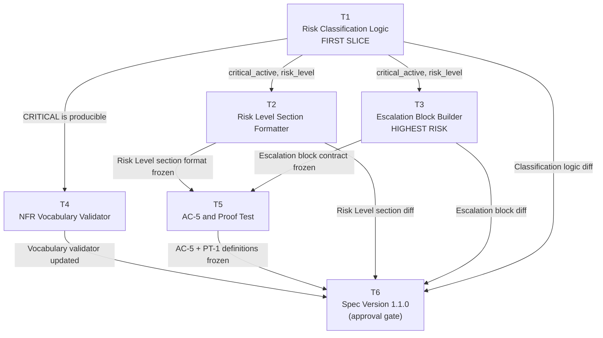

# Task Decomposition — Operational Drift Risk Model Extension

**Tasks version:** 1.0.0
**Delta source:** changes/operational-drift-risk-model/delta.md — version 1.0.0
**Plan source:** changes/operational-drift-risk-model/plan.md — version 1.0.0
**Kata:** K 5.D.6
**Date:** 2026-07-22
**Status:** Planning artefact — no implementation included

---

## Task List

---

### T1 — Risk Classification Logic: CRITICAL Trigger and Boundary Condition

**FIRST SLICE**

```
Task ID:  T1
Title:    Risk Classification Logic: CRITICAL Trigger and Boundary Condition
```

**Input:**

- `specs/operational-drift-analysis/spec.md` v1.0.1 — Section 1.2 Step 6
  (risk level classification table, CRITICAL row definition)
- `changes/operational-drift-risk-model/delta.md` — items A-1, M-1,
  Risk Note (Proof Test: HIGH-preserved-on-no-PDB)
- `changes/operational-drift-risk-model/plan.md` — Component 1

**Output:**

A single reviewable diff to the SKILL prompt definition or the SKILL.md /
spec section that governs risk classification. The diff:

1. Encodes the ordered four-level evaluation: LOW < MEDIUM < HIGH < CRITICAL.
2. Implements the CRITICAL trigger: write-command artefact in State B absent
   from State A.
3. Implements the CRITICAL trigger: replica count in State B < `minAvailable`
   from PDB in State A, **guarded by PDB-presence check** (no PDB → HIGH).
4. Emits a `critical_active` boolean alongside the risk level token.

No other section of the spec or SKILL.md is touched.

**Done:**

- [ ] The CRITICAL write-command trigger is correctly evaluated.
- [ ] The replica-count-below-minAvailable trigger is correctly evaluated
      when a PDB is present in State A.
- [ ] When no PDB is present in State A, replica count reduction produces
      HIGH, not CRITICAL (proof test boundary condition satisfied).
- [ ] `critical_active` is true if and only if risk level is CRITICAL.
- [ ] Existing LOW, MEDIUM, HIGH trigger conditions are unchanged
      (no regression).
- [ ] Diff is under 100 lines.

---

### T2 — Risk Level Section: READINESS IMPACT Annotation

```
Task ID:  T2
Title:    Risk Level Section: READINESS IMPACT Annotation
```

**Input:**

- `specs/operational-drift-analysis/spec.md` v1.0.1 — Section 1.3
  (output structure, Risk Level section)
- `changes/operational-drift-risk-model/delta.md` — items A-3, M-2, R-4
- `changes/operational-drift-risk-model/plan.md` — Component 2
- T1 completed: `critical_active` boolean interface is frozen

**Output:**

A diff to the Risk Level section specification (Section 1.3 of spec.md or
the equivalent SKILL prompt clause). The diff:

1. Adds the conditional annotation clause: when `critical_active` is true,
   the Risk Level section appends exactly:

   ```
   READINESS IMPACT: CRITICAL risk level is a hard block.
   A Ready verdict cannot be issued until this risk level is resolved.
   ```

2. Explicitly states the annotation must NOT appear for LOW, MEDIUM, or HIGH.
3. Does not touch any other output section.

**Done:**

- [ ] The READINESS IMPACT annotation text matches A-3 exactly.
- [ ] The annotation is present in the Risk Level section when and only when
      risk level is CRITICAL.
- [ ] The annotation is absent for LOW, MEDIUM, and HIGH outputs.
- [ ] No other Drift Report section is modified by this diff.
- [ ] Diff is under 100 lines.

---

### T3 — Escalation Block Builder: Conditional Cap and Mandatory Executive Block

**Highest-risk task**

*This task touches two interacting constraints (the cap and the mandatory
block) whose combined effect must not cause LOW/MEDIUM/HIGH reports to
receive either the raised cap or the executive block. A mistake here produces
a caller-visible output regression for all risk levels, not just CRITICAL.*

```
Task ID:  T3
Title:    Escalation Block Builder: Conditional Cap and Mandatory Executive Block
```

**Input:**

- `specs/operational-drift-analysis/spec.md` v1.0.1 — Section 1.2 Step 7,
  Section 6.3 (escalation cap NFR metric)
- `changes/operational-drift-risk-model/delta.md` — items A-2, M-3, R-3
- `changes/operational-drift-risk-model/plan.md` — Component 3
- T1 completed: `critical_active` boolean interface is frozen

**Output:**

A diff to the Recommended Engineering Review section specification and the
NFR metric at Section 6.3. The diff:

1. Adds the conditional cap rule:
   - `critical_active` false → cap 5 blocks (unchanged from v1.0.1).
   - `critical_active` true → cap 6 blocks.
2. Adds the mandatory executive escalation block definition (A-2):

   ```
   Action:    Escalate to engineering leadership and executive sponsor
   Role:      Engineering Lead / Executive Sponsor
   Condition: Risk level is CRITICAL
   Artefact:  Drift Report — Risk Level section
   ```

3. States the mandatory block occupies one of the six CRITICAL slots and
   is always prepended.
4. Updates the NFR metric at 6.3: `≤ 5` → `≤ 6 when risk level is CRITICAL;
   ≤ 5 otherwise`.
5. Does not alter the existing escalation block format or the read-only
   constraint.

**Done:**

- [ ] The mandatory executive block text matches A-2 exactly.
- [ ] The executive block is present when and only when risk level is CRITICAL.
- [ ] The cap is 6 for CRITICAL reports and 5 for all other risk levels.
- [ ] The NFR metric at Section 6.3 reflects the conditional cap.
- [ ] A CRITICAL report with five engineering actions contains exactly six
      blocks total (mandatory + five).
- [ ] A HIGH report with five engineering actions still contains at most five
      blocks (no regression).
- [ ] Diff is under 100 lines.

---

### T4 — NFR Vocabulary Validator: Accept CRITICAL as Valid Token

```
Task ID:  T4
Title:    NFR Vocabulary Validator: Accept CRITICAL as Valid Token
```

**Input:**

- `specs/operational-drift-analysis/spec.md` v1.0.1 — Section 6.3
  (Risk level vocabulary compliance metric)
- `changes/operational-drift-risk-model/delta.md` — items A-4, R-1, R-2
- `changes/operational-drift-risk-model/plan.md` — Component 4
- T1 completed (CRITICAL is now a producible output value)

**Output:**

A diff to the NFR Section 6.3 vocabulary compliance row and any test harness
or evaluation checklist that validates risk level tokens. The diff:

1. Updates the permitted vocabulary list to explicitly include CRITICAL as a
   non-error, expected value.
2. Removes or revises any assertion that CRITICAL is unreachable or anomalous.
3. Adds a note: a vocabulary check that previously asserted CRITICAL was never
   produced must be updated; CRITICAL is now a valid trigger output.

This diff touches only the NFR section and test/evaluation commentary. It
does not modify the classification logic (T1) or the output format (T2, T3).

**Done:**

- [ ] The NFR Section 6.3 vocabulary compliance row lists all four tokens:
      `LOW | MEDIUM | HIGH | CRITICAL`.
- [ ] No assertion remains that CRITICAL is an unreachable or error value.
- [ ] The note from R-2 is recorded: a three-value parser is now incomplete.
- [ ] Diff is under 100 lines.

---

### T5 — Acceptance Criterion AC-5 and Proof Test Definition

```
Task ID:  T5
Title:    Acceptance Criterion AC-5 and Proof Test Definition
```

**Input:**

- `specs/operational-drift-analysis/spec.md` v1.0.1 — Section 1.6
  (acceptance criteria AC-1 through AC-4)
- `changes/operational-drift-risk-model/delta.md` — items A-5, M-4, R-5,
  Risk Note (Proof Test)
- `changes/operational-drift-risk-model/plan.md` — Component 5
- T1, T2, T3 completed: risk level, annotation, and escalation block
  interfaces are frozen

**Output:**

A diff to the acceptance criteria section (Section 1.6) adding:

1. **AC-5** — CRITICAL classification triggered by replica-count-below-
   minAvailable removal:

   - Given: State A has PDB `minAvailable: 2`, Deployment `replicas: 3`.
             State B has Deployment `replicas: 1`, PDB still present.
   - When: Drift Analysis invoked.
   - Then: Risk Level is CRITICAL; READINESS IMPACT annotation is present
           (A-3); mandatory executive escalation block is present (A-2).

2. **Proof Test (PT-1)** — HIGH-preserved-on-no-PDB boundary condition:

   - Given: State A has Deployment `replicas: 3`, no PDB.
             State B has Deployment `replicas: 1`, no PDB.
   - When: Drift Analysis invoked.
   - Then: Risk Level is HIGH (not CRITICAL); READINESS IMPACT annotation
           absent; executive escalation block absent.

AC-1 through AC-4 are not modified.

**Done:**

- [ ] AC-5 matches the delta definition in A-5 exactly.
- [ ] PT-1 matches the delta Proof Test exactly.
- [ ] Both criteria reference the synthetic artefact fields (PDB, Deployment)
      needed to evaluate them.
- [ ] AC-5 references the output obligations from T2 (annotation) and T3
      (executive block).
- [ ] AC-1 through AC-4 are unchanged.
- [ ] Diff is under 100 lines.

---

### T6 — Spec Version Increment to 1.1.0

```
Task ID:  T6
Title:    Spec Version Increment to 1.1.0
```

**Input:**

- `specs/operational-drift-analysis/spec.md` v1.0.1 (existing file)
- All diffs from T1 through T5 — reviewed and accepted
- Explicit approval from Engineering Lead (escalation gate per CLAUDE.md)
- `changes/operational-drift-risk-model/delta.md` — item M-6

**Output:**

The updated `specs/operational-drift-analysis/spec.md` at version 1.1.0,
incorporating exactly the diffs produced by T1 through T5. Changes:

1. Header: version `1.0.1` → `1.1.0`; status remains Draft until sign-off.
2. Section 1.2 Step 6: CRITICAL classification table row — confirmed
   authoritative (no text change; delta ratifies existing text).
3. Section 1.2 Step 7: escalation cap rule updated (from T3 diff).
4. Section 1.3: Risk Level section format includes A-3 annotation clause
   (from T2 diff).
5. Section 1.6: AC-5 and PT-1 added (from T5 diff).
6. Section 5.2: READINESS integration annotation requirement formalised
   (inline with T2 changes).
7. Section 6.3: vocabulary compliance and escalation cap NFR updated
   (from T3 and T4 diffs).

This task must not begin until T1–T5 are complete and the approval gate
is cleared. No new logic is introduced in this task; it is an assembly
and versioning operation only.

**Done:**

- [ ] Engineering Lead approval is recorded before this task is started.
- [ ] Spec header shows version 1.1.0.
- [ ] All five delta ADDED items (A-1 through A-5) are visible in the
      updated spec.
- [ ] All six MODIFIED items (M-1 through M-6) are satisfied in the
      updated spec.
- [ ] No section present in spec v1.0.1 is removed or reordered.
- [ ] Diff is under 100 lines.
- [ ] The existing spec.md is not overwritten before this task is cleared.

---

## Annotations

**FIRST SLICE:** T1

T1 implements exactly one end-to-end acceptance criterion path (the CRITICAL
classification trigger with the PDB boundary condition). It produces the
`critical_active` flag that gates all downstream CRITICAL-specific behaviour.
All downstream tasks (T2, T3, T5) depend on its interface contract. Reviewing
T1 alone confirms whether the core CRITICAL logic is correct before any output
formatting or test evidence is added. The diff is isolated to the
classification logic and touches no output sections.

**Highest-risk task:** T3

T3 modifies the escalation block cap — a constraint that applies to all
Drift Reports, not only CRITICAL ones. Incorrect conditioning (e.g., applying
the raised cap or injecting the executive block to HIGH reports) would produce
a caller-visible regression across the most common output level. The mandatory
executive block and the conditional cap interact: a correct implementation
requires that the cap is evaluated after the block is injected, not before.
This ordering dependency is subtle and is the most likely source of a
regression that would not be caught by AC-5 alone (AC-5 only verifies the
CRITICAL path; a HIGH regression requires PT-1 or a separate regression test
on the escalation cap).

---

## Interface Contracts

### Seam 1 — T1 → T2, T3, T5

**Producer:** T1 produces the Risk Classification Logic interface.
**Consumers:** T2, T3, and T5 all consume the `critical_active` boolean and
the risk level token.
**The interface is frozen after T1 is reviewed and accepted.**

Contract:

```
risk_level: "LOW" | "MEDIUM" | "HIGH" | "CRITICAL"
critical_active: boolean  (true iff risk_level == "CRITICAL")
rationale: string         (one sentence citing the trigger condition)
```

No downstream task may re-evaluate artefacts or findings to determine risk
level. All CRITICAL-conditional behaviour is gated exclusively on
`critical_active`.

---

### Seam 2 — T2 → T5

**Producer:** T2 defines the Risk Level section output format, including the
conditional READINESS IMPACT annotation clause.
**Consumer:** T5 (AC-5) verifies that the annotation is present in a CRITICAL
Drift Report.
**The Risk Level section format is frozen after T2 is reviewed and accepted.**

Contract:

```
risk_level_section: string
  — when critical_active == false: "[risk_level] — [rationale]"
  — when critical_active == true:  "[risk_level] — [rationale]\n\n
      READINESS IMPACT: CRITICAL risk level is a hard block.\n
      A Ready verdict cannot be issued until this risk level is resolved."
```

---

### Seam 3 — T3 → T5

**Producer:** T3 defines the Recommended Engineering Review section format,
including the mandatory executive escalation block and the conditional cap.
**Consumer:** T5 (AC-5) verifies that the executive block is present in a
CRITICAL Drift Report and absent in a non-CRITICAL report (PT-1).
**The escalation block contract is frozen after T3 is reviewed and accepted.**

Contract:

```
escalation_section:
  — when critical_active == false:
      1–5 ranked engineering action blocks. No executive block.
  — when critical_active == true:
      1 mandatory executive block (Action / Role / Condition / Artefact
      as defined in A-2) + 0–5 ranked engineering action blocks.
      Total blocks: 2–6. Cap: 6.
```

---

### Seam 4 — T1, T2, T3 → T4

**Producer:** T1 establishes that CRITICAL is a producible risk level value.
**Consumer:** T4 updates the NFR vocabulary validator to accept CRITICAL.
T4 does not depend on the output format (T2, T3); it depends only on the
existence of the CRITICAL token as a valid classification result.
**Dependency:** T4 may begin as soon as T1 is accepted.

---

### Seam 5 — T1, T2, T3, T4, T5 → T6

**Producer:** T1 through T5 each produce a reviewable diff against the
specification.
**Consumer:** T6 assembles all diffs into spec v1.1.0 and updates the header.
**The escalation gate (Engineering Lead approval) must be cleared before T6
begins.**
**T6 is the terminal task. All seams above are frozen before T6 starts.**

---

## Dependency Graph



---

## Engineering Review

### Challenge 1 — Does every task fit in one afternoon?

| Task | Estimate | Justification |
|---|---|---|
| T1 | Half afternoon | Modifies one logical section (classification table + boundary condition). The PDB carve-out is the only complex branching. |
| T2 | Quarter afternoon | Adds a conditional annotation clause to one output section. Mechanical once T1 is accepted. |
| T3 | Half afternoon | Two interacting changes (cap + mandatory block). Requires careful ordering. Warranted complexity. |
| T4 | Quarter afternoon | NFR table update and a commentary note. Low complexity. |
| T5 | Half afternoon | Two structured test definitions (AC-5 + PT-1) referencing frozen contracts from T1–T3. |
| T6 | Half afternoon | Assembly and versioning only. Gated by approval. No new logic. |

All tasks fit within one afternoon. No task requires cross-cutting changes
that would extend across multiple sessions.

---

### Challenge 2 — Does every task produce a diff below 100 lines?

| Task | Expected diff scope |
|---|---|
| T1 | ~20–35 lines: one classification section, one boundary condition clause, one flag definition. |
| T2 | ~10–20 lines: one conditional annotation clause in one section. |
| T3 | ~25–40 lines: cap rule + mandatory block definition + NFR row update. |
| T4 | ~10–15 lines: one NFR table row update + a commentary note. |
| T5 | ~30–50 lines: two structured test definitions (AC-5 + PT-1). |
| T6 | ~40–70 lines: header + six section edits assembled from prior diffs. |

All tasks are well below the 100-line ceiling.

---

### Challenge 3 — Does any task say "implement everything"?

No. Each task is scoped to exactly one concern:

- T1: classification logic only.
- T2: Risk Level section format only.
- T3: escalation cap and mandatory block only.
- T4: NFR vocabulary validation only.
- T5: acceptance criteria and proof test only.
- T6: spec assembly and version bump only.

---

### Challenge 4 — Are seams explicit?

Yes. Five seams are defined:

- Seam 1: T1 → T2, T3, T5 (risk_level + critical_active interface).
- Seam 2: T2 → T5 (Risk Level section format).
- Seam 3: T3 → T5 (escalation block contract).
- Seam 4: T1 → T4 (CRITICAL as producible token).
- Seam 5: T1–T5 → T6 (terminal assembly gate).

Each seam states its producer, its consumers, and the moment at which the
interface is frozen.

---

### Challenge 5 — Does the FIRST SLICE (T1) implement only one acceptance criterion?

T1 implements exactly one logical path: the CRITICAL risk classification
trigger and its boundary condition (PDB presence check). This corresponds
to the trigger condition evaluated in AC-5 (replica count below minAvailable)
and the Proof Test (HIGH when no PDB). T1 does not produce the output
sections verified by AC-5 (those are T2 and T3). T1 produces only the
`critical_active` flag and risk level token. This is the minimal reviewable
unit that unblocks all other work.

---

## Verification Report

| Requirement | Met | Evidence |
|---|---|---|
| 4–8 tasks | Yes | 6 tasks (T1–T6) |
| Each task has Task ID, Title, Input, Output, Done | Yes | All six tasks above |
| Every task produces a reviewable diff under 100 lines | Yes | Challenge 2 table |
| Every task is independently reviewable | Yes | Each task touches one concern; T2–T5 depend only on T1's frozen interface |
| Tasks depend only on previously completed tasks | Yes | Dependency graph; no circular dependencies |
| Exactly one FIRST SLICE marked | Yes | T1 |
| FIRST SLICE is one AC end-to-end under 100 lines | Yes | T1 implements the CRITICAL trigger path; ~20–35 lines |
| Highest-risk task identified with one-sentence explanation | Yes | T3 — conditional cap + mandatory block interact and can regress HIGH reports |
| Interface Contracts section present | Yes | Five seams defined |
| Each seam names producer, consumers, and freeze point | Yes | Seams 1–5 above |
| Mermaid dependency graph present | Yes | Graph above |
| Engineering Review challenges all five criteria | Yes | Challenges 1–5 above |
| No task says "implement everything" | Yes | Challenge 3 confirmed |

---

*No implementation. Planning artefact only.*
